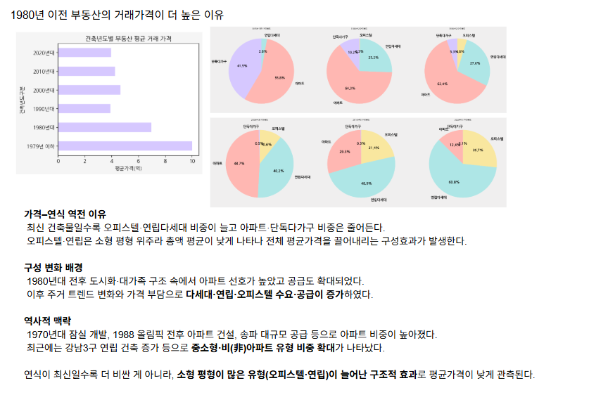

# 🏠 서울시 부동산 실거래가 분석 프로젝트

## 📌 프로젝트 개요

- 본 프로젝트는 서울시 열린데이터광장에서 제공하는 부동산 실거래가 데이터를 수집하여, 서울의 **집값 상승 요인**과 **지역별 부동산 시장의 특징**을 분석하는 것을 목표로 함
- **Streamlit 기반의 웹 대시보드**를 구현하여  
  사용자가 직접 구·용도·면적·연식·층수·예산 등의 조건을 선택하고,  
  이에 맞는 매물을 **지도와 표로 즉시 확인**할 수 있도록 제공
  
---

## 🎯 목적

- 서울시의 실거래가 데이터를 통해 **부동산 가격 변화의 원인과 흐름**을 파악
- **지역별 시세 변화**, **거래량 트렌드**, **특이 거래 탐지** 등을 분석
- 지역별 시세 및 거래 트렌드를 시각화하여 일반 사용자도 쉽게 이해할 수 있도록 구성
- 최종적으로 Streamlit 기반 대시보드를 통해 대중이 직접 탐색 가능한 분석 시스템 제공

---

## 📂 사용한 데이터
서울특별시에서 이루어진 부동산 실거래   내역을 분석 가능한 형태로 전처리한 데이터 셋. 거래 유형, 가격, 위치, 면적등의 속성을 포함함

- **출처**: [서울열린데이터광장 - 부동산 실거래가 정보](https://data.seoul.go.kr/)
- **기간**: 2006년 ~ 2024년
- **형태**: CSV (연도별 파일), 아파트·연립·단독주택 포함
- **전처리 항목**: 거래일자, 법정동, 거래금액, 면적, 층, 건축년도 등
- **총 행 수**: 372,934개
- **결측치**: 0개

| 열 이름   | 설명                   | 데이터 타입  | 예시 값  |
| ------ | -------------------- | ------- | ------------- |
| 자치구명   | 자치구 단위의 지역명          | object  | 강서구           |
| 법정동명   | 법정동 단위의 지역명          | object  | 가양동           |
| 건물명    | 건물의 명칭  | object  | 강서한강자이        |
| 건축년도   | 건물이 지어진 연도           | float64 | 2013.0        |
| 층      | 거래된 층수               | float64 | 2.0           |
| 건물용도   | 건물의 용도               | object  | 아파트           |
| 건물면적   | 실사용 면적 (㎡)           | float64 | 37.638260     |
| 물건금액   | 거래된 금액 (억 단위)        | float64 | 14.99         |
| 건축년도구분 | 건축연도에 따른 구간 분류       | object  | 2010년대        |
| 층구분    | 층수 범주화 정보            | object  | 05층이하         |
| 건물면적구분 | 면적 범위에 따른 구분         | object  | 30평대          |

---

## 🔍 EDA (Exploratory Data Analysis)

### 1️⃣ 가설 설정 (Hypotheses)
EDA 분석 방향 제시

1. 건물 용도에 따라 가격 차이가 클 것이며, 아파트가 가장 비쌀 것이다.
2. 건물 층이 높을수록 가격이 높을 것이다.
3. 건물 면적이 클수록 가격이 높을 것이다.
4. 건축연도가 최근일수록 가격이 높을 것이다.

### 2️⃣ 데이터 분석

### 2️⃣ 데이터 분석

- **건축 연도, 면적 등 다양한 변수 간 상관관계 탐색**  
  [🔎 EDA 노트북 보기 (GitHub)](https://github.com/yura103/seoul-housing-EDA/blob/main/eda/EDA_Seoul.ipynb)

- **건물용도와 물건금액의 상관관계**  
  - 건물용도별 평균 가격 차이 확인  
  - 단독다가구가 상대적으로 높은 가격 수준 형성  
  

- **층과 물건금액의 상관관계**  
  - 저층(5층 이하)과 중·고층 구간 간 가격 분포 차이 존재  
  - 일부 구(예: 중구)에서는 **저층 > 중층** 역전 현상 관찰  
  

- **건물면적과 물건금액의 상관관계**  
  - 면적이 넓을수록 가격은 증가하나  
  - 구별·용도별로 **40평대 > 50평대**와 같은 역전 현상 존재  
  

- **건물년도와 물건금액의 상관관계**  
  - 최신 건물일수록 가격이 높아야 하나, **평균 가격이 오히려 낮아지는 현상** 발생  
  - 원인: 최신 연식에서 오피스텔·연립다세대 비중이 늘어난 **구성효과**  
    
  

### 3️⃣ 분석 결과 요약
#### 가설 ① 건물용도와 가격
- 예상과 달리 **아파트가 아닌 단독다가구의 평균 가격이 가장 높음**.  
- 단독다가구 자체가 아파트보다 비싸다기보다는, **단독다가구는 대형 평수(60평 이상)에 집중**되어 있어 절대 가격이 높게 형성된 결과임.  
- 평당 가격 기준으로 보면 오히려 아파트가 더 높은 추세를 보임.  
- 따라서, 단독다가구는 “평수가 커서 총액이 비싼” 효과, 아파트는 “평당 단가가 높은” 효과로 구분할 수 있음.  

#### 가설 ② 층수와 가격
- 전반적으로 층수가 높을수록 가격이 오르는 경향 확인.  
- 다만 중구에서는 **5층 이하의 단독다가구 비중이 높아**, 5층 이하 평균가격이 오히려 10층 이하보다 비싸게 나타나는 역전 현상 발생.  
- 이는 층수 자체보다는 **건물용도의 분포(단독다가구 집중)**가 가격 차이에 더 큰 영향을 준 사례임.  

#### 가설 ③ 면적과 가격
- 전반적으로 면적이 넓을수록 가격 상승.  
- 하지만 강서·송파에서는 “40평대 > 50평대” 역전 현상 발생.  
  - 이유: 40평대는 **아파트 비중이 매우 높아(70~90%)** 가격이 끌어올려짐.  
  - 반면 50평대는 **단독다가구 비중이 늘고 아파트 비중이 줄어**, 평균가격이 상대적으로 낮아짐.  
- 즉, 면적 효과보다는 **용도 구성 효과**가 가격 역전에 더 큰 역할을 함.  

#### 가설 ④ 건축연도와 가격
- 일반적으로는 신축일수록 비싼 경향.  
- 그러나 최신 연식일수록 오피스텔·연립다세대 비중이 커져, **평균가격이 낮아지는 구조적(구성) 효과** 발생.  
- 반대로, 입지가 좋은 구도심(예: 1979년 이전 단독다가구·아파트)은 연식이 오래되었음에도 높은 가격을 유지.  

---

👉 종합적으로, **평균 가격의 차이는 단순히 층·면적·연식 때문이 아니라, 각 구간에서의 건물용도 분포(구성효과)에 의해 크게 달라짐**을 확인할 수 있었습니다.

---

## 🚀 Streamlit 앱

서울 주거 데이터를 간단한 조건으로 골라보고, **지도와 표로 한눈에 비교**할 수 있는 대시보드입니다.  
사이드바에서 **구·용도·면적·연식·최소 층수·예산(최소~최대)** 을 선택하면 결과가 바로 반영됩니다.

- **즉시 필터링**: 선택한 조건에 맞는 매물만 실시간으로 업데이트
- **지도 시각화**: 구역·역세권 등 공간적 분포를 직관적으로 파악
- **표 정렬/검색**: 가격, 면적, 층수 등 주요 지표를 정렬·검색하여 비교
- **현재 선택된 필터**: 좌측 패널에 선택한 구·용도·면적·연식·최소 층수·예산 범위와 매물 수를 요약 표시
- **상세 드릴다운**: 지도 마커(또는 표 행) 클릭 시 상세 정보 팝업

---

## 📈 아쉬웠던 점 및 향후 발전 계획

- 주변 인프라 데이터를 적극적으로 활용하지 못 한 점
- 미래의 변동될 가격을 반영하지 못 한 점
- 향후에는 지하철역 거리, 학군, 범죄율, 기후 요인까지 포함한 분석도 가능
- 대시보드는 서울 전 지역을 포괄했으나, 본 EDA는 강서구·송파구·중구에 한정해 분석한 점
---

## 🏆 성과
- **2024 국민대학교 D&A 학회 Basic Session EDA Competition 1등**
  - *1st Place, 2024 Kookmin Univ. D&A Basic Session EDA Competition*

